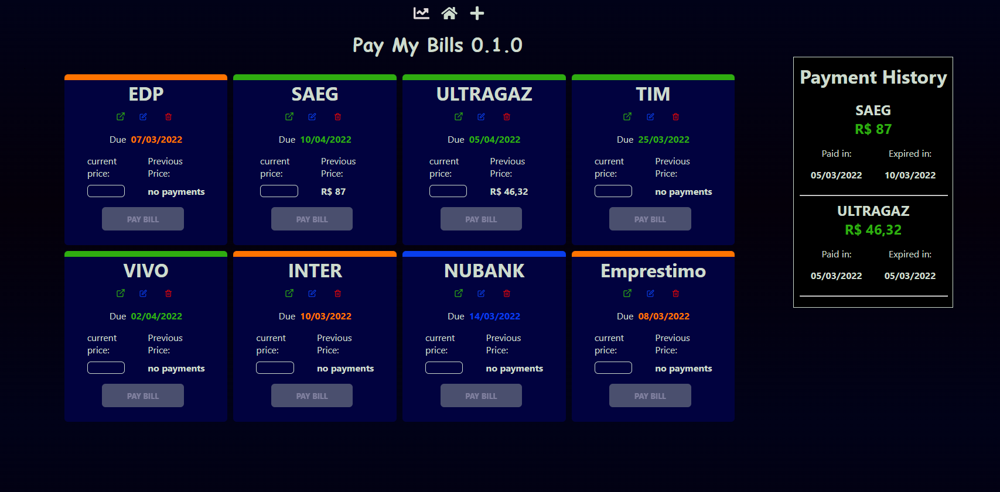
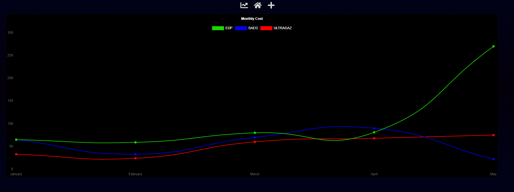

# PAY MY BILLS  

Do you have problems keeping up with all the bills you have to pay ? no ? just me ?  
Well, I built this web app for myself, but you can use it if you like !

### Pay My Bills is a basic recurring expenses management web app  
It is actually very simple:   
you register a new bill with the name, the next expiration date and url to access the website of the bill,  
the bill item will keep up with the expiration day and warn you by status colors:
  - **green**: just paid
  - **blue**: far from expiration
  - **yellow**: close from expiration
  - **red**: late

once you click the "pay bill" button (after typing the value)  
it will reset for the next month and register the payment on the Payment History section.  
Remember, the app only lets you click the "pay bill" button on the yellow or red status.  

the first functional prototype is ready, but there is a MILLION things to improve,  
I plan to add a lot more features for general financial management.

## Comming soon
Line chart component to visualize your monthly expenses

### here is the node API: <a href="https://github.com/akiosTerr/pay-my-bills-api">pay-my-bills-api</a>  
to use it, just put your mongo URI on the config file, you know how it is

*like always, feel free to make suggestions!*
